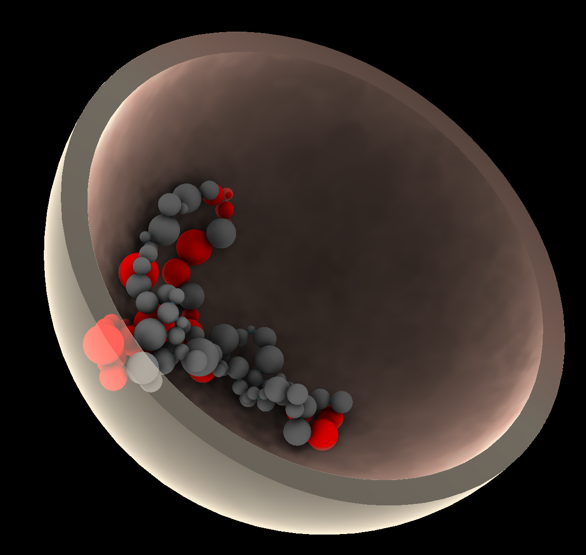
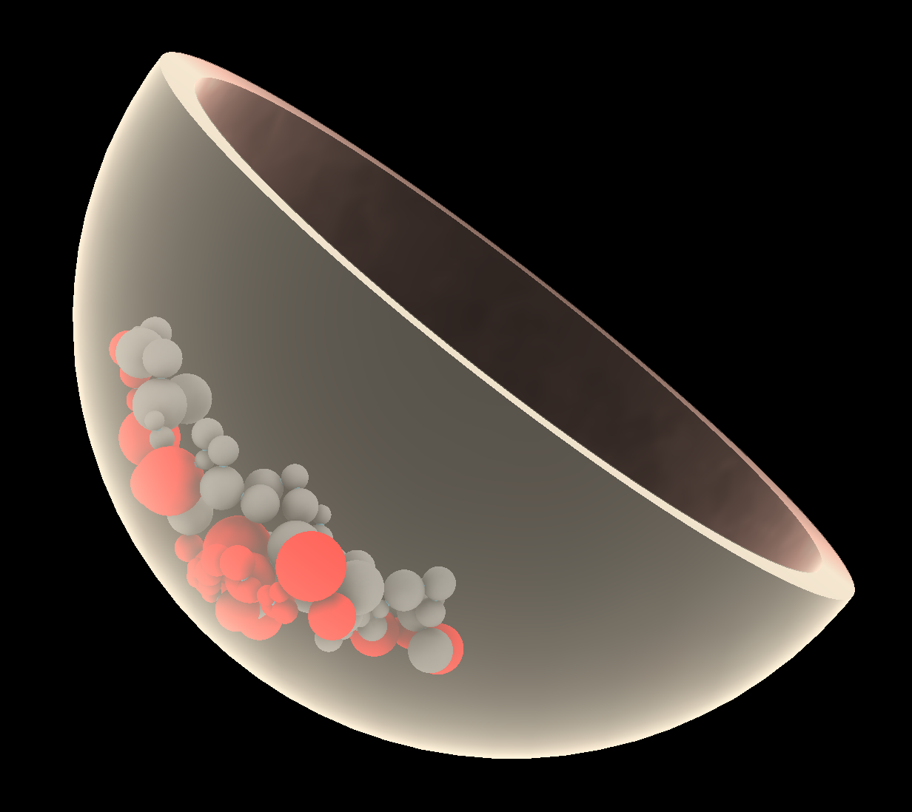

# Making 3D genome models using Chrom3D (a tutorial)

This is a step-by-step guide showing how to use [Chrom3D](https://github.com/Chrom3D/Chrom3D) to generate a 3D genome model, and how to visalize this. The guide takes you through all steps from raw reads (fastq) to final results. To allow a relatively fast procedure, Hi-C input data have been downsampled to only include reads mapping to human chromosome 18. This tutural can be run on a personal computer (running MacOS or Linux) or an external server. **The steps take ~30 minutes to run from start to end**.

A step-by-step guide using the full Hi-C data set (from all chromosomes) is avalable here. This takes ~20 hours to complete, and likely requires an external (HPC) server to efficiently run.

This tutorial uses [HiC-Pro](https://github.com/nservant/HiC-Pro) to map and process the Hi-C data into intra- and interchromosomal contact maps. From these, TADs are called using [Armatus](https://github.com/kingsfordgroup/armatus), which are used to delineate the genome into contiguous genome segments defining beads in the 3D genome models. Statistically significant interactions are identified between segments using the Non-central Hypergeometric distribution defining inter-bead constraints. LADs from chromatin immunoprecipitation-sequencing (ChIP-seq) of lamin B1 are used to restrain beads towards the nuclear periphery. The process of calling LADs from ChIP-seq reads is not considered here. The Hi-C and ChIP-seq data used here come from a [published study](https://www.nature.com/articles/s41588-019-0392-0) of 4D genome dynamics during adipogenic differentiation. To generate the 3D genome model, we use [Chrom3D](https://github.com/Chrom3D/Chrom3D). Chrom3D considers (i) significant pairwise interaction between genomic segments determined from Hi-C data to infer a 3D placement of these relative to each other, and (ii) significant interactions of chromatin with the nuclear lamina (LADs) determined e.g. from lamin ChIP-seq to infer a positioning of genomic segments relative to the nuclear periphery. In Chrom3D, chromosomes are modeled as chains of contiguous beads each representing a genome segment. The nucleus boundary is modeled as a sphere of 5 μm radius. Modeling starts from a random configuration of the chromosomes which is optimized using Monte Carlo simulations to produce a 3D genome structure. Reiterating the process hundreds of times, each time starting from a random bead configuration, yields an ensemble of 3D structures that recapitulate key features of 3D genome topologies in a population of cells. The final 3D models are visualized using UCSF ChimeraX [16].

To perform the steps in this step-by-step guide a computer running Unix/Linux or macOS, and/or a server running Linux is needed. The bash shell is used to run all the commands specified in the step-by-step guide. It is assumed that the user is somewhat knowledgeable in using the command line.

# Software needed to run the steps described:
To follow the steps in this tutorial you will first need to install some software (see list below). Some of these tools might already be installed on your system, and other tools might be a bit challenging to install, such as Armatus and HiC-Pro. If you are having trouble installing the tools, ask your system administrator or a colleague with knownedge of UNIX systems to help you.
- [Boost](https://www.boost.org/users/history/version_1_73_0.html) ([Installation instructions](https://www.boost.org/doc/libs/1_74_0/more/getting_started/unix-variants.html#prepare-to-use-a-boost-library-binary)) (required by Chrom3D and Armatus)
- [Chrom3D v1.0.2](https://github.com/Chrom3D/Chrom3D/releases/tag/v1.0.2) ([Installation instructions](https://github.com/Chrom3D/Chrom3D#installation-instructions)) (available in your path)
- [Armatus 2.3](https://github.com/kingsfordgroup/armatus/archive/master.zip) ([Installation instructions](https://github.com/kingsfordgroup/armatus#building-from-source)) (available in your path) 
- [HiC-Pro 2.11](https://github.com/nservant/HiC-Pro/releases/tag/v2.11.4) ([Installation instructions](https://github.com/nservant/HiC-Pro#how-to-install-it-)) (available in your path)
- [Bedtools2](https://github.com/arq5x/bedtools2/releases/tag/v2.29.2) ([Installation instructions](https://bedtools.readthedocs.io/en/latest/content/installation.html)) (available in your path)
- [Python  2.7 or 3](https://www.python.org/) ([Installation instructions](https://wiki.python.org/moin/BeginnersGuide/Download)) (available in your path)
- [statsmodels](https://www.statsmodels.org/) ([Installation instructions](https://www.statsmodels.org/stable/install.html))
- [ChimeraX](https://www.rbvi.ucsf.edu/chimerax/) ([Installation instructions](https://www.rbvi.ucsf.edu/chimerax/download.html)) (installed on your local computer)

# A step-by-step guide showing how Chrom3D can be used to generate a 3D genome model of human chromsome 18
**1.  Setup this tutorial and download the Hi-C data**
```bash
git clone https://github.com/Chrom3D/INC-tutorial.git
cd INC-tutorial
```

**2. Download LAD data**

We will use LADs (in BED format) based on Lamin B1 ChIP-seq data in the same cell-line.
```bash
mkdir lad
curl -o lad/GSE109924_lad_D0-rep1.bed.gz https://ftp.ncbi.nlm.nih.gov/geo/series/GSE109nnn/GSE109924/suppl/GSE109924_lad_D0-rep1.bed.gz
gunzip lad/GSE109924_lad_D0-rep1.bed.gz
```

**3. Setting up HiC-Pro**

HiC-Pro will be used to process the Hi-C data, including mapping the reads and aggregation of the contact frequencies.
```bash
curl -O https://raw.githubusercontent.com/nservant/HiC-Pro/master/config-hicpro.txt
curl -O https://raw.githubusercontent.com/nservant/HiC-Pro/master/annotation/chrom_hg19.sizes
curl -O https://raw.githubusercontent.com/nservant/HiC-Pro/master/annotation/HindIII_resfrag_hg19.bed
curl -O ftp://ftp.ccb.jhu.edu/pub/data/bowtie2_indexes/hg19.zip # Large file, might take a few minutes to download
unzip hg19.zip -d hg19
```

**4. Downloading and installing the required processing scripts**

As part of the Chrom3D package, several processing scripts are available to reformat and process the data to prepare for running Chrom3D.
```bash
mkdir processing_scripts
curl -OL https://github.com/Chrom3D/preprocess_scripts/archive/v.1.2.zip
unzip -j -d processing_scripts/ v.1.2.zip preprocess_scripts-v.1.2/NCHG_hic.zip
unzip -j -d processing_scripts/ v.1.2.zip preprocess_scripts-v.1.2/cap_chr_end.py
unzip -j -d processing_scripts/ v.1.2.zip preprocess_scripts-v.1.2/make_diploid_gtrack.py
unzip -j -d processing_scripts/ v.1.2.zip preprocess_scripts-v.1.2/NCHG_fdr_oddratio_calc.py
unzip -j -d processing_scripts/ v.1.2.zip preprocess_scripts-v.1.2/unmappable_blacklist.bed
unzip -j -d processing_scripts/ v.1.2.zip preprocess_scripts-v.1.2/makeGtrack.py
```

**5. Installing NCHG**

This program, which is also part of the Chrom3D package, determines statistically significant interactions from Hi-C data based on the Non-central Hypergeometric distribution.
```bash
unzip -d processing_scripts/ processing_scripts/NCHG_hic.zip
make -C processing_scripts/NCHG_hic/
```

**6. Adapting the `config-hicpro.txt` file**

To prepare for running HiC-Pro, we will need to change two lines in the `config-hicpro.txt` file. Use a text-editor (like emacs, vim, nano, (or TextEdit [MacOS]) to:
- Add the bowtie path to line nr. 39: `BOWTIE2_IDX_PATH =` -> `BOWTIE2_IDX_PATH = [fullpath]/INC-tutorial/hg19]/` where `[fullpath]` is the full path to your current working directory
- Change line nr. 89: `BIN_SIZE = 20000 40000 150000 500000 1000000` -> `BIN_SIZE = 50000 1000000`

**7. Run HiC-Pro (Takes ~10 minutes)**
```bash
HiC-Pro --input fastq --output hicpro_results --conf config-hicpro.txt
```

**8. Setup the folder structure for the HiC contacts**
```bash
mkdir -p hic/bedpe/intra
mkdir -p hic/matrix
```

**9. Convert Hi-C to BEDPE and matrix format**

The output from HiC-Pro needs to be converte to [BEDPE](https://bedtools.readthedocs.io/en/latest/content/general-usage.html#bedpe-format) in order to be processed further by Chrom3D, and to a matrix format in order to be compatible with the Armatus TAD caller.
```bash
#BEDPE:
awk 'NR==FNR { map[$4] = $1"\t"$2"\t"$3; next } { print $0,map[$1],map[$2] }' hicpro_results/hic_results/matrix/chr18/raw/50000/chr18_50000_abs.bed hicpro_results/hic_results/matrix/chr18/raw/50000/chr18_50000.matrix  | awk '$4==$7' | awk '{print $4"\t"$5"\t"$6"\t"$7"\t"$8"\t"$9"\t"$3}' > hic/bedpe/intra/chr18

# Matrix format:
for chr in hic/bedpe/intra/*
do
chrname=$(basename $chr)
cut -f 2,5,7 $chr > hic/matrix/$chrname
done
```

**10. Running Armatus to call TADs**
```bash
mkdir hic/tads
armatus-linux-x64 -r 50000 -c chr18 -S -i hic/matrix/chr18 -g .6 -o hic/tads/chr18
```

The `-r 50000` sets the bin-size to 50000 bp,  `-c chr18` specifies that only chromosome 18 should be considdered, `-i hic/matrix/chr18` provides the input data (in matrix format), `-g .6` is the gamma-max parameter indicating the highest resolution to generate domains (often is set based on trial and error, `-o hic/tads/chr18` gives the output for the TADs.


**11. Since Armatus output is end-inclusive, convert to BED by adding 1 to end position**
```bash
awk '{printf("%s\t%i\t%i\n",$1,$2,$3+1)}' hic/tads/chr18.consensus.txt > hic/tads/chr18.consensus.bed
```

**12. Convert called TADs into a segmented genome to define Chrom3D beads**
```bash
bedtools complement -L -i hic/tads/chr18.consensus.bed -g chrom_hg19.sizes | cat - hic/tads/chr18.consensus.bed | bedtools sort -g chrom_hg19.sizes > chr18_beads.bed
```
This one-liner combines the complementary (non-TAD) genomic regions (found using `bedtools complement`) with the TADs to generate a fully segmented chromosome 18 (needed by Chrom3D. `-L` in `bedtools complement` limits output to solely the chromosomes with records in the input file. `-g` specifies the chromosome size. `bedtools sort` orders the genomic regions by their position on the chromosome. This file will define the "beads" in the Chrom3D model.

**13. Map intra-chromosomal interactions from Hi-C to the beads defined in the previous step and aggregate the contacts between these beads**
```bash
cat hic/bedpe/intra/chr* | awk '{printf("%s\t%s\t%s\n",$1,$2,$2+1)}' | bedtools intersect -wao -a stdin -b chr18_beads.bed | cut -f 4,5,6 > left.tmp
cat hic/bedpe/intra/chr* | awk '{printf("%s\t%s\t%s\t%s\n",$4,$5,$5+1,$7)}' | bedtools intersect -wao -a stdin -b chr18_beads.bed | awk '{printf("%s\t%s\t%s\t%s\n",$5,$6,$7,$4)}' > right.tmp

paste left.tmp right.tmp | awk '{a[$1"\t"$2"\t"$3"\t"$4"\t"$5"\t"$6] += $7} END{for (i in a) print i"\t"a[i]}' |  awk '$2!=$5' | sort -k 2n,2n > chr18_bead_interactions.intra.bedpe
rm left.tmp right.tmp
```
This maps the left and right part of the Hi-C interactions to the using `bedtools intersect`) to the Chrom3D beads defined in the previous step. Then, the left and right parts are combined (with `paste`) and their Hi-C contact frequencies are aggregated (using `awk`) to generate a BEDPE file consisting of contact frequencies between all beads on the chromosome.

**14. Remove interactions between beads overlapping centromeres**
```bash
curl -s "http://hgdownload.cse.ucsc.edu/goldenPath/hg19/database/cytoBand.txt.gz" | gunzip -c | grep acen | bedtools pairtobed -a chr18_bead_interactions.intra.bedpe -b stdin -type neither > chr18_bead_interactions.intra.nocen.bedpe
```
This is done, since interactions involving centromeric beads are often artefactual.

**15. Identifying statistically significant inter-bead interactions within chromosomes, using the Non-central Hypergeometric distribution (NCHG)**
```bash
processing_scripts/NCHG_hic/NCHG -m 50000 -p chr18_bead_interactions.intra.nocen.bedpe > chr18_bead_interactions.intra.nocen.NCHG.out
python processing_scripts/NCHG_fdr_oddratio_calc.py chr18_bead_interactions.intra.nocen.NCHG.out fdr_bh 2 0.01 > chr18_bead_interactions.intra.nocen.NCHG.sig
```
Here, `NCHG` is used to determine statistically singificant interactions between beads. `-m 50000` gives the minimum interaction length (in bp), `-p chr18_bead_interactions.intra.nocen.bedpe` specifies the input file. The output is redirected into the file `chr18_bead_interactions.intra.nocen.NCHG.sig`. The `NCHG` program uses the Non-central Hypergeometric distribution to determine statistically singificant interactions. This model takes into account the total number of interactions on the chromosome, the number of interactions for the two involved beads, and the genomic/linear distance between the two beads.

**16. Generate the Chrom3D input file in GTrack format, specifying the 3D model setup**

Chrom3D relies on the [GTrack](https://github.com/gtrack/gtrack) file format for specifying the model setup. This includes the genomic position of the beads, their size, interactions between them and interactions with the nuclear periphery. This input file also defines the color of the beads.
```bash
# Make a GTrack file specifying all beads and interactions between them:
python processing_scripts/makeGtrack.py chr18_bead_interactions.intra.nocen.NCHG.sig chr18_beads.bed > chr18_bead_interactions.gtrack
# Add LAD information to the GTrack file:
echo -e "##gtrack version: 1.0\n##track type: linked segments\n###seqid\tstart\tend\tid\tradius\tperiphery\tedges" > chr18_bead_interactions.lads.gtrack

bedtools intersect -c -a chr18_bead_interactions.gtrack -b lad/GSE109924_lad_D0-rep1.bed | awk '{if($7>=1) print $1 "\t" $2 "\t" $3 "\t" $4 "\t" $5 "\t1\t" $6; else  print $1 "\t" $2 "\t" $3 "\t" $4 "\t" $5 "\t.\t" $6}' >> chr18_bead_interactions.lads.gtrack 
```

**17. Run Chrom3D based on the GTrack file**
```bash
Chrom3D -c 0.001 --nucleus -l 10000 -y 0.01 -r 5.0 -n 100000 chr18_bead_interactions.lads.gtrack > model.cmm
```


**18. Visualizing `model.cmm` in ChimeraX**
- If you are running this step-by-step guide on a server, download the `model.cmm` file to your local computer
- The resulting `model.cmm` (and `model_redlad.cmm` from step 19) can be opened in ChimeraX and displays of these turned on and off in the bottom right "Models" panel. To generate tomographic views of models, the command "clip" can be used in the "Command:" field in the bottom panel of ChimeraX. Background color and other graphical adjustments can be performed by clicking the "Graphics" button in the top panel.
- In ChimeraX, the command "shape sphere center 0,0,0 radius 5.0 color #ffc9b5 slab 0.5" can be used in the "Command" field in the bottom panel to display a nucleus structure on top of the model view. To change opacity of the nucleus model, click the colored square called "sphere" in the "Models" panel in the bottom right of the view, and select e.g. 30%. 
- Again, "clip" can be used to clip this to generate tomographic views. The model can also be tilted to allow a better perception of depth in the structures. Figure 4 shows some of the resulting illustrations that can be generated using ChimeraX.


**19. Coloring beads defined by LADs using red color**
```bash
unzip -j -d processing_scripts/ v.1.2.zip preprocess_scripts-v.1.2/color_beads.py

awk '$6==1' chr18_bead_interactions.lads.gtrack | cut -f 4 > lads.ids
python processing_scripts/color_beads.py model.cmm lads.ids 255,0,0 OVERRIDE > model_redlad.cmm
```
- Do the steps from step 18., but open and visualize the `model_redlad.cmm` file instead

**Example of visualization in ChimeraX**:

   
